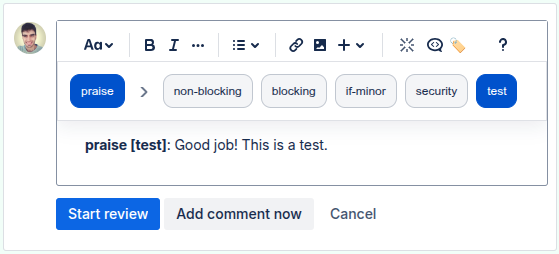

# Code Review Tags (Conventional Comments)

A lightweight browser extension that adds tags and decorations in the style of [Conventional Comments](https://conventionalcomments.org/) directly in Pull Request comment editors.

- Fast UI with tags (praise, nitpick, suggestion, issue, ...)
  and decorations (non-blocking, blocking, if-minor, ...).
- Inserts a consistent prefix at the start of the comment: `Label [decorations]:` in bold.
- Fully customizable: tags, decorations, default tag, and visibility in replies.
- Toolbar button to show or hide the built-in panel.
- Works on Bitbucket Cloud (Pull Requests). GitHub and GitLab support is planned.

## Install

---

## Compatibility

- Bitbucket Cloud: `https://bitbucket.org/*/pull-requests/*`
- Browsers: Chrome, Edge, Firefox.
- GitHub and GitLab: on the roadmap (see TODO).

## Installation (local / temporary)

Load from `src/` (useful during development):

- Chrome/Edge: `chrome://extensions` --> "Load unpacked" --> select `src/`.
- Firefox: `about:debugging#/runtime/this-firefox` --> "Load Temporary Add-on..." --> select `src/manifest.json`.

## Quick Use

1. Open a Pull Request on Bitbucket.org.
2. In the comment editor you'll see the "Code Review Tags" panel with:
   - A tag selector shown as chips; after you pick one, it collapses to reveal the decoration chips.
   - Optional decoration chips (e.g., non-blocking, security, test).
   - A "🏷️" button in the editor toolbar to show/hide the panel.
3. When you select a tag (and optionally decorations), the extension automatically inserts a prefix at the start of the comment in the format: `Label [decorations]: ...` (the `Label [decorations]` part is bold for easy scanning).
4. Use the "X" to clear the prefix and close the panel.

## Settings

Open the extension popup and go to "Extension settings" (or from the browser's extensions page --> Options):

- Labels: editable, comma-separated list (the reserved entry `X` is ignored).
- Decorations: editable, comma-separated list.
- Default label on load: initial default tag.
- Replies: show panel by default in replies; otherwise open it with the toolbar button.

Changes are saved to the browser's `storage.sync`. The extension reloads to apply them.

## Privacy

- Permissions: only `storage` to save settings (tags, decorations, and visibility preferences).
- The extension does not read or send the contents of your comments to external servers; it only manipulates the page's local DOM.
- Privacy policy: see `docs/privacy.html` in this repository.

## Development

The extension is written in vanilla JavaScript as a WebExtension (Manifest V3). No bundlers required.

- Main structure:
  - `src/manifest.json`: permissions, matches, and pages.
  - `src/content/core.js`: common UI + prefix logic.
  - `src/content/platforms/bitbucket.js`: Bitbucket selectors and toolbar handling.
  - `src/content/main.js`: main content script orchestrating core + platform.
  - `src/style.css`: panel styles (light/dark modes).
  - `src/ui/options/index.html` and `src/ui/options/index.js`: options page.
  - `src/ui/popup/index.html`: popup with quick links.

### How it works (key points)

- The content script detects Bitbucket editor containers and adds the panel once per editor.
- The toolbar button (🏷️) is inserted and kept at the end of the editor's toolbar.
- The prefix is applied and kept as `<strong>Label [decorations]</strong>:` at the start of the editor's first block, adjusting the caret so typing is uninterrupted.
- When editing existing comments, the extension detects previous prefixes (bold or plain text) and updates them safely.

## Contributing

PRs are welcome! If you want to help:

- Open an Issue to discuss major changes or new platform support.
- Use small, focused PRs; clearly describe the scope and add screenshots if you change the UI.
- Keep the style simple (native JS/DOM with no unnecessary dependencies).
- Test in light/dark mode and in both comment and reply editors.

### Adding support for another platform (hints)

- Add the domain to `content_scripts.matches` in `manifest.json`.
- Create a new `src/content/platforms/<name>.js` implementing:
  - `editorContainerSelector`, `toolbarSelector` (used by the observer for scheduling)
  - `getEditorEl(container)`, `isReplyEditor(editorEl)`
  - `ensureToolbarToggle(container, panel)`
  - Optional:
    - `findToolbar(container)`
    - `syncToolbarButton(container, visible)` (the orchestrator checks for existence before calling)
- Register it under `globalThis.CodeReviewTags.platforms.<name>` and include the file in `manifest.json` before `src/content/main.js`.
- Ensure the toggle button visually integrates into the platform toolbar (clone classes/structure if needed).
- Note: The current core integration targets rich contenteditable editors (e.g., ProseMirror/TipTap). If the target platform uses plain `<textarea>`, you'll likely need to add editor hooks (read/apply prefix + caret handling) to `core.js` or a small adapter layer to handle text content safely.

## TODO

- GitHub support (PRs): matches, editor and toolbar selectors, caret tests.
- GitLab support (MRs): matches, editor and toolbar selectors, caret tests.
- Screenshots/GIFs for the README and store listing.
- UI i18n (ES/EN) and tooltips.
- Support more browsers (Safari via Safari Web Extensions).

## Attributions

- Inspired by the [Conventional Comments](https://conventionalcomments.org/) standard.
- Not affiliated with Atlassian/Bitbucket/GitHub/GitLab.

---

Made with ❤️ to speed up reviews and improve technical communication.

41aef65f2f5a412092bc22a9260ce04a
6fd72e90393e4be7adc9c428e49b3eec